# BeeAI Issue Creator

<div align="center">

[](https://gitingest.com/i-am-bee/beeai-issue-creator)
[](https://deepwiki.com/i-am-bee/beeai-issue-creator)
[](LICENSE)

</div>

> [!WARNING]
> This project is in early beta stage. Expect bugs and breaking changes.

A multi-agent system for creating well-structured GitHub issues using the [BeeAI Framework](https://framework.beeai.dev/experimental/requirement-agent). This system coordinates between specialized agents to draft issues, check for duplicates, and create final GitHub issues with customizable templates. The system is consumable via the [BeeAI Platform](https://beeai.dev) (UI and CLI) through the A2A protocol.

✅ Multi-agent workflow  
🔄 Real-time trajectory tracking  
📝 Customizable issue templates

## What is BeeAI Issue Creator?

The BeeAI Issue Creator orchestrates a multi-step workflow using specialized agents:

- **Project Manager**: Coordinates the entire workflow and manages agent handoffs
- **Technical Writer**: Creates structured issue drafts from user input using templates, grounded with project documentation for technical accuracy
- **Analyst**: Searches for existing similar issues to prevent duplicates

This gives you consistent, professional GitHub issues while preventing duplicates and maintaining quality standards. The system integrates with GitHub through the [GitHub MCP server](https://github.com/modelcontextprotocol/servers/tree/main/src/github) for seamless repository interactions.

## Use Cases

Perfect for:
- Automated issue creation from user reports
- Maintaining consistent issue formatting across repositories
- Preventing duplicate issues through intelligent search
- Multi-step workflows with user approval gates

## Agents Included

🎯 **[Project Manager](src/agents/agent_manager.py)** - Manages the complete issue lifecycle from draft to creation  
📝 **[Technical Writer](src/agents/agent_writer.py)** - Creates structured issues using customizable templates  
🔍 **[Analyst](src/agents/agent_analyst.py)** - Searches for similar existing issues

## Features

- **Template Support**: Bug report and feature request templates
- **Documentation Grounding**: Technical Writer uses project documentation for technical accuracy
- **GitHub Integration**: Seamless interaction through GitHub MCP server
- **Issue Types Support**: Automatic detection and use of organization issue types with fallback to default types (Feature/Bug)
- **Trajectory Tracking**: Real-time visibility into agent interactions and tool usage
- **Duplicate Prevention**: Intelligent search for existing similar issues
- **User Approval**: Human-in-the-loop workflow with approval gates
- **Conditional Requirements**: Enforced workflow steps and dependencies
- **Repository-Scoped Tools**: Pre-configured GitHub tools with repository context for better security

## Quickstart

```bash
# Install dependencies
uv sync --group dev

# Copy and edit environment variables
cp .env.example .env
# Set your MODEL, API_KEY, GITHUB_PAT, and templates in .env

# Start the agent server
uv run server
```

The server will start on `http://127.0.0.1:8000` and register the GitHub Issue Creator agent that coordinates the complete workflow.

## Security Considerations

> [!WARNING]
> **Important Security Notes:**
> 
> - **GitHub Token Scoping**: It is **critical** to scope your GitHub Personal Access Token (GITHUB_PAT) to only the specific repositories you intend to use with this system. Do not use tokens with broad repository access.
> 
> - **Approval Feature Not Functional**: The user approval/permission feature is currently not working correctly. This means the agent **will create GitHub issues without explicit user approval**. Review all generated content carefully and ensure your GitHub token has appropriate restrictions.

## Configuration

### Environment Variables

Configure the system using environment variables:

```bash
# Model Configuration
MODEL=openai:gpt-5-nano
API_KEY=your_api_key_here

# GitHub Configuration  
GITHUB_PAT=your_github_personal_access_token
GITHUB_REPOSITORY=owner/repository-name

# Documentation for issue grounding (optional)
DOCS_URL=https://example.com/llms-full.txt

# Issue Templates (URLs preferred)
TEMPLATE_BUG_URL="https://raw.githubusercontent.com/user/repo/main/.github/ISSUE_TEMPLATE/bug_report.md"
TEMPLATE_FEATURE_URL="https://raw.githubusercontent.com/user/repo/main/.github/ISSUE_TEMPLATE/feature_request.md"

# Alternative: Direct template content
TEMPLATE_BUG="your bug report template..."
TEMPLATE_FEATURE="your feature request template..."
```

## Workflow

```mermaid
flowchart TD
    A[👤 User Input<br/>Bug/Feature Description] --> B[🎯 Project Manager<br/>Workflow Coordination]

    B --> C[📝 Technical Writer]
    C --> D[📄 Draft Created<br/>with Templates]
    D --> E[👤 User Approval<br/>Approve/Request Changes]

    E -->|Changes| C
    E -->|Approved| F[🔍 Analyst]

    F --> G[🔎 Search Similar Issues<br/>via GitHub MCP]
    G --> H[📋 Duplicate Report]
    H --> I[👤 Final Confirmation]

    I --> J[🚀 Create GitHub Issue<br/>via GitHub MCP]

    K[📚 Templates<br/>Bug/Feature] -.-> C
    L[📖 Documentation<br/>Grounding] -.-> C
    M[🔧 GitHub MCP Server<br/>Issues & Types API] -.-> F
    M -.-> J
    M -.-> |Issue Types<br/>Grounding| B

    style A fill:#e1f5fe
    style B fill:#fff3e0
    style C fill:#f3e5f5
    style F fill:#e8f5e8
    style J fill:#e8f5e8
    style K fill:#f0f0f0
    style L fill:#f0f0f0
    style M fill:#f0f0f0
```



1. **User Input**: Describe the bug or feature request
2. **Draft Creation**: Technical Writer creates structured draft using templates
3. **Duplicate Check**: Analyst searches for similar existing issues
4. **User Review**: User reviews and approves the draft
5. **Issue Creation**: Final GitHub issue is created with proper formatting

## Development

```bash
# Install development dependencies
uv sync --group dev

# Run linting
uv run ruff check

# Run formatting
uv run ruff format
```

## Architecture

The system uses the BeeAI Framework's Requirement Agent with:
- **Conditional Requirements**: Enforced workflow sequence
- **Handoff Tools**: Agent-to-agent delegation
- **Permission Requirements**: User approval gates
- **Trajectory Middleware**: Real-time progress tracking

## Documentation

For more information on the BeeAI Framework: https://framework.beeai.dev

## Roadmap

- [ ] 🚧 **Improve multi-turn conversations** - Better context handling across multiple interactions
- [ ] **Pass artifacts by reference** - Reference artifacts in conversation history instead of including full content
- [ ] **Treat issues as artifacts** - Return issue drafts as artifacts in A2A protocol instead of messages
- [ ] **Add evaluation datasets** - Comprehensive testing with real-world issue examples
- [ ] **Improve agent configuration** - Configure GitHub repository from BeeAI Platform UI
- [ ] **Add RAG instead of grounding** - Dynamic document retrieval for better context
- [ ] **Add streaming support** - Real-time response streaming for better UX
- [ ] **Build as Docker image** - Containerized deployment for easier hosting
- [ ] **Artifact support** - Enable rich content generation and interactive editing capabilities
- [x] **GitHub Labels field** - Allow the agent to correctly populate the labels ([#312](https://github.com/github/github-mcp-server/issues/312))
- [ ] **Support attachements** - Allow users to upload files (screenshots, videos)
- [ ] 🚧 **GitHub Issue Types Support** - Automatic detection and use of organization issue types with fallback
- [x] **MCP direct repository configuration** - Pre-configure the MCP tool with repository settings instead of relying on LLM to pass repository name
- [x] **Improve trajectory metadata** - Enhanced progress tracking and debugging capabilities
- [x] **Elicitation support** - Interactive tool use approval and clarification workflows

## Contributing

Feel free to submit improvements, additional templates, or new agent capabilities via pull requests.